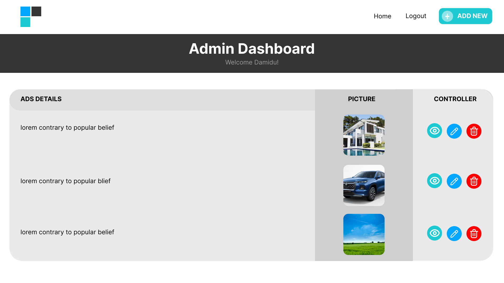

# Real Estate Property 

This is a full-stack web application for real estate property listings. It includes a user-facing frontend for browsing properties and an admin panel for managing property listings.

## Features

### User Features
- Filter properties by price range and property type
- View detailed information about each property
- Responsive design for desktop and mobile devices

### Admin Features
- Create new property listings
- Update existing property listings
- Delete property listings

## Technologies Used

### Frontend
- React.js
- Axios for API requests
- React Router for navigation

### Backend
- Node.js
- Express.js
- MongoDB for database
- Mongoose for database modeling

## Setup and Installation

1. Clone the repository
2. Install dependencies for both frontend and backend  
``cd backend
npm install`` 
``cd client
npm install`` 
3. Set up environment variables
Create a `.env` file in the root directory and add the following: 
``MONGO_URI=mongodb://localhost:27017/real_estate`` 
``PORT=5000`` 
4. Start the development server 
Backend - `npm start` 
client - `npm start` 

## Usage

### User Interface (http://localhost:3000)
- Browse properties on the homepage carousel
- Use filters for min price, max price, and property type
- Click on properties to view details

### Admin Panel (http://localhost:3000/admin)
- Log in with admin credentials
- Create new property listings
- Update existing listings
- Delete property listings

## API Endpoints

- GET /api/properties: Fetch all properties 
- POST /api/properties: Create a new property listing (Admin only) 
- PUT /api/properties/:id: Update a property listing (Admin only) 
- DELETE /api/properties/:id: Delete a property listing (Admin only) 

## Contributing
Contributions are welcome! Please feel free to submit a Pull Request. 
## UI

## Author
- UI Designer  [Dimuthu Ruwantha](https://github.com/Dimuthu-2000)
- Developer  [Damidu Gimhan](https://github.com/DamiduGimhan20)
## License
This project is licensed under the MIT License.

